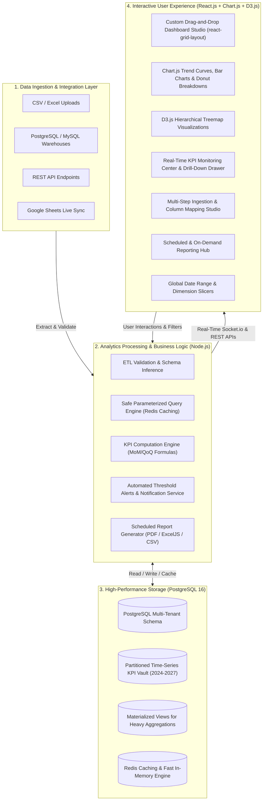

# Enterprise BI & Data Analytics Dashboard Platform

<div align="center">


<p align="center">
  <b>A complete, production-ready Business Intelligence and Data Analytics command platform.</b><br/>
  Delivers custom drag-and-drop dashboards, real-time KPI scorecards with threshold alerting, multi-source ETL pipelines, and automated executive report distribution.
</p>

</div>

---

## 🛠️ Core Technology Stack Breakdown

| Technology Layer | Framework / Library | Role & Implementation in Platform |
| :--- | :--- | :--- |
| **Frontend Framework** | **React.js 18 (Vite + TypeScript)** | Component-driven UI, Zustand global state, TanStack React Query for cached data synchronization, responsive Tailwind CSS layouts with Dark/Light theme support. |
| **Backend Engine** | **Node.js & Express (TypeScript)** | Modular REST API service, JWT/RBAC security middleware, safe parameterized SQL query builder, 4-phase ETL data ingestion, and Socket.io WebSocket server. |
| **Data Storage** | **PostgreSQL 16** | 14 multi-tenant relational tables, **RANGE partitioning on `kpi_values` (2024–2027)**, JSONB schema/dataset storage, and `mv_kpi_monthly_aggregates` materialized views with zero-downtime refresh. |
| **Data Visualizations** | **Chart.js 4 & D3.js v7** | **Chart.js**: Line charts, Grouped/Stacked Bar charts, Donut breakdowns, Area curves, and Scatter plots. <br/>**D3.js**: Dynamic hierarchical Treemap visualizations and proportional data partition matrices. <br/>**Gauges & Tables**: Target speedometer gauges, Sparklines, and paginated data grids. |

---

## 🧭 Executive System Architecture (For Project Managers)

The platform is structured into **Four Core Business Value Streams** across a reliable 3-Tier Technical Foundation:



---

## 📊 Core Capabilities Matrix (Business Value Stream)

| Business Capability | Primary User | Key Features & Value Delivered | Associated Module |
| :--- | :--- | :--- | :--- |
| **Custom Dashboard Builder** | Executives, Business Analysts | Drag-and-drop widget canvas (`react-grid-layout`), **Chart.js** & **D3.js** visualizers (Line, Bar, Donut, Area, Scatter, D3 Treemaps, KPI cards, Tables, Gauges), instant print/PDF export. | `client/src/components/dashboard/` <br/> `client/src/components/widgets/` |
| **KPI & Threshold Monitoring** | Operations & Finance Leads | Real-time metric tracking, Month-over-Month (MoM) delta percentages, sparkline trajectories, and automated multi-level alerts (**Warning** / **Critical**). | `client/src/components/kpi/` <br/> `server/src/modules/kpis/` |
| **Multi-Source ETL Ingestion** | Data Engineers, Admins | 4-step ingestion wizard supporting CSV/Excel files, relational DBs, REST APIs, and Google Sheets with automated type inference, data preview, and error logging. | `client/src/components/dataImport/` <br/> `server/src/modules/dataSources/` |
| **Automated Executive Reporting** | Management, External Board | Scheduled cron dispatch and on-demand generation of executive PDF briefings, CSV extracts, and formatted multi-tab Excel workbooks. | `client/src/components/reports/` <br/> `server/src/modules/reports/` |
| **Security, RBAC & Audit Trail** | Compliance & System Admins | Multi-tenant isolation on `org_id`, JWT authentication, granular permission matrix (Admin, Editor, Viewer), and immutable write mutation audit logs. | `server/src/middleware/` <br/> `server/src/modules/auditLogs/` |

---

## 🗂️ Project Directory Architecture & Deliverable Mapping

```
📁 Data-Analytics-Business-Intelligence-Dashboard/
│
├── 📂 database/                               # DATABASE & DATA MODEL LAYER (PostgreSQL)
│   ├── 📄 schema.sql                          # Complete PostgreSQL DDL (14 Multi-tenant tables, Partitions, Triggers)
│   ├── 📄 seed.sql                            # Enterprise seed data (SaaS metrics, E-Commerce, Users, Dashboards, KPIs)
│   └── 📄 erd.md                              # Entity Relationship Diagram & Cardinality Specifications
│
├── 📂 server/                                 # BACKEND SERVICE LAYER (Node.js + Express + TypeScript)
│   ├── 📂 src/
│   │   ├── 📂 config/                         # Environment variables (Zod schema validation) & Winston logger
│   │   ├── 📂 db/                             # PostgreSQL connection pool, Redis cache & In-memory resilient engine
│   │   ├── 📂 middleware/                     # JWT Auth, Role-Based Access Control (RBAC), and Write Audit Logger
│   │   ├── 📂 modules/
│   │   │   ├── 📂 auth/                       # User Login, Registration, Profile, and Refresh Token Handlers
│   │   │   ├── 📂 dashboards/                 # Dashboard CRUD & Parameterized SQL Query Engine (Whitelisted)
│   │   │   ├── 📂 kpis/                       # KPI Formula Engine, PoP Calculations & Threshold Alert Evaluator
│   │   │   ├── 📂 dataSources/                # Multi-Source Connectors (CSV/Excel/REST/DB) & ETL Ingestion Pipeline
│   │   │   ├── 📂 reports/                    # Headless PDF Generator, ExcelJS Workbook Builder & Cron Scheduler
│   │   │   ├── 📂 auditLogs/                  # Security Audit Trail and Mutation Inspector
│   │   │   ├── 📂 realtime/                   # Socket.io WebSocket Gateway for live client event streaming
│   │   │   └── 📂 docs/                       # OpenAPI / Swagger Specification at /api/docs
│   │   ├── 📂 types/                          # Domain Type Definitions strictly aligned with PostgreSQL schema
│   │   ├── 📄 app.ts                          # Express application pipeline & middleware configuration
│   │   └── 📄 index.ts                        # Server entry point, background worker bootstrap & port binding
│   ├── 📄 Dockerfile                          # Multi-stage production container build for Backend
│   └── 📄 package.json                        # Backend dependencies & compilation scripts
│
├── 📂 client/                                 # FRONTEND APPLICATION LAYER (React.js 18 + Vite + Tailwind CSS)
│   ├── 📂 src/
│   │   ├── 📂 components/
│   │   │   ├── 📂 dashboard/                  # Drag-and-drop Dashboard Studio, Widget Cards & Add Widget Modal
│   │   │   ├── 📂 widgets/                    # Chart.js & D3.js components (Line, Bar, Pie, Area, Scatter, D3 Treemap, Gauge, Table)
│   │   │   ├── 📂 kpi/                        # KPI Monitoring Cards, Sparklines & Historical Drill-Down Drawer
│   │   │   ├── 📂 dataImport/                 # 4-Step ETL Ingestion Wizard, Source Connector & Dataset Explorer
│   │   │   ├── 📂 reports/                    # Scheduled Report Setup Modal & Export Download Archive
│   │   │   ├── 📂 audit/                      # Security & Mutation Audit Log Viewer with JSON Diff inspection
│   │   │   ├── 📂 layout/                     # Application Shell, Collapsible Sidebar, Topbar & Global Filter Bar
│   │   │   └── 📂 auth/                       # Login & Register Views with 1-Click Persona Quick-Switchers
│   │   ├── 📂 hooks/                          # React Query Data Hooks (useDashboards, useKpis, useDataSources, etc.)
│   │   ├── 📂 services/                       # REST API Client & Socket.io Real-Time Client
│   │   ├── 📂 store/                          # Global Zustand State Store (Auth, Date Range, Dimension Slicers, Theme)
│   │   ├── 📂 types/                          # Frontend TypeScript interfaces (matching Backend & DB contracts)
│   │   ├── 📄 App.tsx                         # Client Master Routing & Protected Route Guards
│   │   └── 📄 main.tsx                        # React DOM mounting & Tailwind initialization
│   ├── 📄 Dockerfile                          # Multi-stage production container build with Nginx
│   └── 📄 package.json                        # Frontend dependencies (React, Chart.js, D3.js, Recharts, Tailwind)
│
├── 📄 docker-compose.yml                      # Full-stack Docker orchestration (Postgres + Redis + API + Client)
└── 📄 README.md                               # Project documentation & execution guide
```

---

## ⚡ Quick Start & Execution Guide

### Option 1: Docker Compose (All Services)
```bash
docker-compose up --build -d
```
- **React Web App**: [http://localhost:3000](http://localhost:3000)
- **Node.js API Gateway**: [http://localhost:5000/api](http://localhost:5000/api)
- **Interactive Swagger Documentation**: [http://localhost:5000/api/docs](http://localhost:5000/api/docs)
- **Health Check & Diagnostics**: [http://localhost:5000/health](http://localhost:5000/health)

### Option 2: Local Development
1. **Start Backend Server**:
   ```bash
   cd server
   npm install
   npm run dev
   ```
2. **Start Frontend Client**:
   ```bash
   cd client
   npm install
   npm run dev
   ```

---

## 🔑 Pre-Seeded Stakeholder Demo Personas

The platform comes pre-seeded with three operational personas for immediate demonstration:

| Persona / Role | Email | Password | Business Responsibilities & Permissions |
| :--- | :--- | :--- | :--- |
| **System Administrator** | `admin@apex.io` | `Password123!` | Full control: configure data sources, run ETL jobs, manage users, and inspect security audit logs. |
| **Business Analyst / Editor** | `editor@apex.io` | `Password123!` | Create & edit visual dashboards, configure KPI formulas, and schedule automated reports. |
| **Executive Stakeholder / Viewer** | `viewer@apex.io` | `Password123!` | Read-only access to published executive dashboards, scorecards, and exported briefing files. |

*(The login screen includes **1-click quick role selector buttons** for instant demo presentation).*
