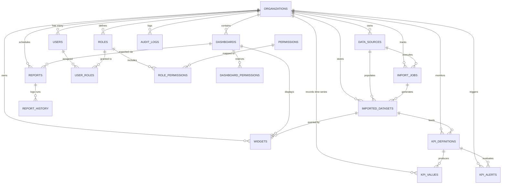

# Database Entity Relationship Diagram & Architecture Specification

## 1. Entity Relationship Model (ERD)

## 2. Table Summary & Cardinality

| Table Name | Primary Key | Foreign Keys & Targets | Indexing & Constraints | Partitioning / Materialization |
| :--- | :--- | :--- | :--- | :--- |
| `organizations` | `id` (UUID) | None | Unique `slug`, B-Tree on `slug` | Base multi-tenant root |
| `users` | `id` (UUID) | `org_id` -> `organizations(id)` | Unique `(org_id, email)`, B-Tree on `email`, `org_id` | Multi-tenant user auth |
| `roles` | `id` (UUID) | `org_id` -> `organizations(id)` | Unique `(org_id, name)` | Multi-tenant RBAC |
| `permissions` | `id` (UUID) | None | Unique `code`, B-Tree on `category` | Global permission matrix |
| `role_permissions`| `(role_id, permission_id)` | `role_id` -> `roles`, `permission_id` -> `permissions` | Composite PK | RBAC mapping |
| `user_roles` | `(user_id, role_id, org_id)` | `user_id`, `role_id`, `org_id` | Composite PK | User role assignment |
| `audit_logs` | `id` (UUID) | `org_id` -> `organizations`, `user_id` -> `users` | `org_id`, `created_at DESC`, `(entity, entity_id)` | Append-only immutable log |
| `data_sources` | `id` (UUID) | `org_id` -> `organizations`, `created_by` -> `users` | `org_id`, `type` | Multi-source connectors |
| `import_jobs` | `id` (UUID) | `org_id`, `data_source_id`, `created_by` | `org_id`, `data_source_id`, `status`, `created_at DESC` | Async ETL tracking |
| `imported_datasets`| `id` (UUID) | `org_id`, `data_source_id`, `import_job_id` | `org_id`, `data_source_id` | Schema & queryable tables |
| `dashboards` | `id` (UUID) | `org_id`, `created_by` -> `users` | `org_id`, `created_by` | Drag-and-drop dashboards |
| `widgets` | `id` (UUID) | `dashboard_id` -> `dashboards`, `org_id`, `dataset_id` | `dashboard_id`, `org_id`, `dataset_id` | Chart & KPI configurations |
| `dashboard_permissions`| `id` (UUID) | `dashboard_id`, `user_id`, `role_id` | Check constraint on `(user_id XOR role_id)` | Granular dashboard access |
| `kpi_definitions` | `id` (UUID) | `org_id`, `dataset_id`, `created_by` | Unique `(org_id, code)` | Formula & threshold rules |
| `kpi_values` | `(id, period_start)` | `kpi_id` -> `kpi_definitions`, `org_id` | `(org_id, kpi_id, period_start DESC)`, `status` | **Partitioned by RANGE (period_start)** |
| `kpi_alerts` | `id` (UUID) | `kpi_id`, `org_id`, `acknowledged_by` | `org_id`, `kpi_id`, `status`, `triggered_at DESC` | Incident trigger logs |
| `reports` | `id` (UUID) | `org_id`, `dashboard_id`, `created_by` | `org_id`, `dashboard_id`, `is_active` | Scheduled exports |
| `report_history` | `id` (UUID) | `report_id`, `org_id`, `created_by` | `report_id`, `org_id`, `generated_at DESC` | Export execution log |
| `mv_kpi_monthly_aggregates` | Materialized View | References `kpi_values`, `kpi_definitions` | Unique index on `(org_id, kpi_id, month_start)` | **Concurrent Heavy Aggregations** |

## 3. High-Performance Design Features
1. **Time-Series Partitioning**:
   `kpi_values` is range-partitioned annually (`kpi_values_2024`, `kpi_values_2025`, `kpi_values_2026`, `kpi_values_2027`, `kpi_values_default`), drastically speeding up time-window aggregations and enabling effortless data retention truncation.
2. **Materialized View for Heavy Computations**:
   `mv_kpi_monthly_aggregates` computes reading counts, min, max, average, sum, target deviations, and alert frequencies. It features a unique index enabling zero-downtime `REFRESH MATERIALIZED VIEW CONCURRENTLY`.
3. **JSONB Adaptability**:
   Columns `widgets.grid_layout`, `widgets.query_config`, `widgets.visual_config`, `data_sources.connection_settings`, and `reports.filter_config` offer infinite frontend extensibility without brittle schema migrations.
4. **Referential Integrity & Cascading**:
   All tenant child tables feature `ON DELETE CASCADE` on `org_id` for instant GDPR/tenant eviction compliance, while user deletion preserves dataset history via `ON DELETE SET NULL`.
